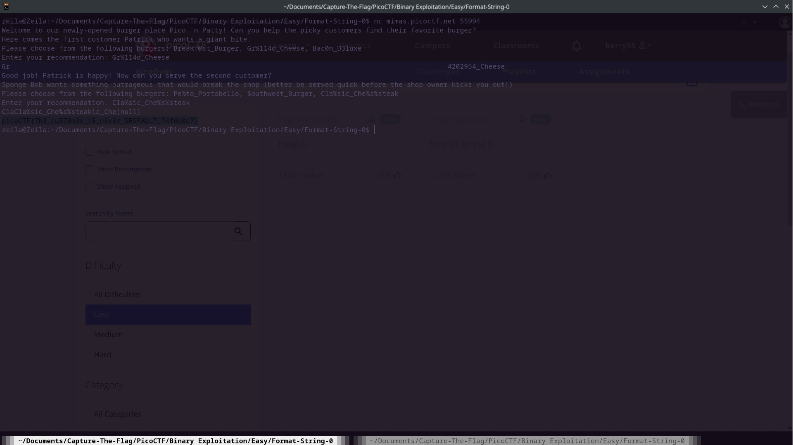

# Format String 0


## Background

The program is choice based and requires understanding of the if conditions to reach the end of the program. Once
the end of the program is reached, the flag will be outputted. There are only two if conditions therefore we can reach
the end of the program easily through brute forcing a total of 6 permutations.


## Solution

Our program has the function:

```
void sigsegv_handler(int sig) {
    printf("\n%s\n", flag);
    fflush(stdout);
    exit(1);
}
```

Which prints out our flag. The signal.h library handles signals sent by the program, this handler function takes care of sigseg
otherwise known as segmentation fault signals. To retrieve our flag we must then have a sigseg which calls this function. Unfortunately
the program is handled in such a way as there are no obvious ways to directly invoke the function by causing a segmentation fault, so we'll
attempt to complete the function

1. **First Condition**

```
char *menu1[3] = {"Breakf@st_Burger", "Gr%114d_Cheese", "Bac0n_D3luxe"};
...
int count = printf(choice1)
count > 2 * BUFSIZE
```

The count of the item we choose must be greater than twice the variable bufsize, which is set to 32. Neither of our options are that large
however the second option has a string slicing within it, specifically '%114d'. The syntax of the printf function in C uses the character '%' 
then is followed by a number of parameters including a length modifier. When the second option is entered into the printf the %114d translates 
to 114 characters and 'd' which stands for the int variable a length of 4 bytes. Therefore our option "Gr%114d_Cheese" is greater than twice bufsize.


2. **Second Condition**

```
scanf("%s", choice2);
    char *menu2[3] = {"Pe%to_Portobello", "$outhwest_Burger", "Cla%sic_Che%s%steak"};
    if (!on_menu(choice2, menu2, 3)) {
```

The second condition simply checks whether or not the input is equal to the third option in the array being "Cla%sic_Che%s%steak". After choosing the
two correct outputs we've reached near the end of the program.

## Flag

The flag is outputted after our second condition is met, however we simply print our previous input and flush everything then exit, so why does the program
output the flag? The reason is 

``` 
printf(choice2);

```

This function sigfaults and calls our earlier helper function. This means that printing "Cla%sic_Che%s%steak" must cause a sementation fault somehow. 
Our seg fault occurs because of the repeated %s flag characters without any parameters at the end of the function. There are no pointers for the %s to 
reference to therefore the pointers are attempting to access undefined memory, causing a sigfault and printing out our flag. 
