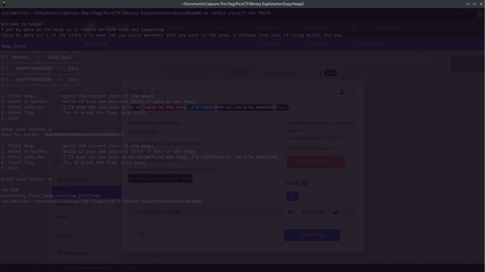

# Heap 0 


## Background

Heap exploitation is the process of manipulating data allocation in the heap to access data outside
of the intended memory bounds. In C some functions are unsafe as they don't restrict the bounds of 
variables. One such function is scanf which reads from input and stores it into a buffer. By inputting
variables larger than the expected memory, we can overflow the buffer and exlpoit the C program.


## Solution

The chall.c program has the scanf function which we can use for our heap exploitation. In the program, we 
have global variable sizes for the input data size and the 'safe_var' variable size. These variables have 
a defined size which is dynamically allocated on the heap: 

```
    input_data = malloc(INPUT_DATA_SIZE);
    strncpy(input_data, "pico", INPUT_DATA_SIZE);
    safe_var = malloc(SAFE_VAR_SIZE);
    strncpy(safe_var, "bico", SAFE_VAR_SIZE);
```
The input data size and safe var size are both 5, the malloc function returns a total of 20 bytes due to
the INPUT_DATA_SIZE being the integer 5 and malloc size of each integer being 4 bytes 5 * 4 = 20. The size
allocated in total is 24 bytes which can be calculated by running the malloc_useable_size() function in the
malloc.h glib.c library. To overflow the heap buffer, we must input a total of 32 characters. The reason for 
this is likely due to padding or underlying architecture which creates chunks of 32 bytes in malloc. Inputting
32 characters would store a total of 33 characters with the null terminator '\n' being appended to the input. 
This heap overflow would write over the safe_var variable, returning us the flag once we run the print flag case (4):

