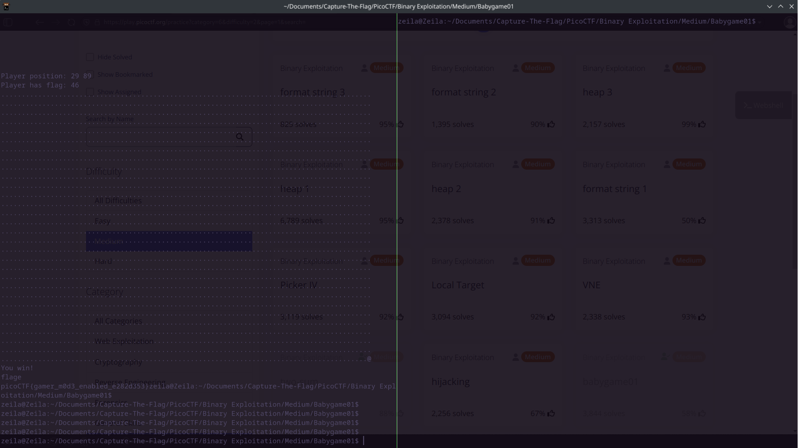

# Babygame01

## Background

The file is given to us in in a 32 bit elf format, a linux elf file compiled likely on 
a 64 bit system. After installing the compiling the game using the gcc-multilib compiler, 
we can execute the file. The program is a text-based cli game that scans characters on a 
loop and the characters determine the action performed. The game isntructs us to retrieve
a flag and find an escape.


## Solution

First to see what the characters on the keyboard map to I inputted the characters one by one
into the game and noted the resulting action. It seems as if the characters awsd move the position
of the player west, north, south, and east respectively. The only other character that seems to
have any effect is the letter p which automatically finds the escape for us, which is one part of
the challenge solved. All that's left is to find the flags. Finding the flag proved difficult without
any file source or map to guide us so brute-force attempts may be our only option. After trying 
a combination of movements outside of our screen, I found that escaping one step north out of 
the cli near the north-eastern corner of the game with coords 

```
x:87, y = -1 
x:86, y = -1
```

gave us a flag of 46 and 64 respectively. However being on the 85~th~ x coordinate gave us a seg
fault and moving around in that area was like playing minesweeper. Those two flags were the only
one's I could find through trial and error. After capturing a flag all that's left to do is press
'p' to escape and the flag is printed to the screen. 
