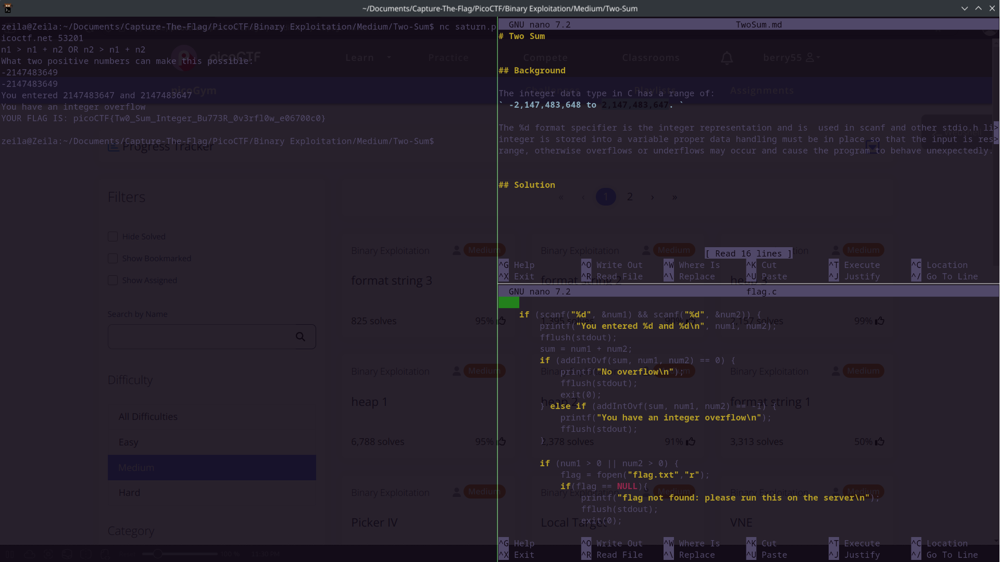

# Two Sum

## Background

The integer data type in C has a range of:
` -2,147,483,648 to 2,147,483,647. `

The %d format specifier is the integer representation and is  used in scanf and other stdio.h library functions. When an 
integer is stored into a variable proper data handling must be in place so that the input is restricted to within this 
range, otherwise overflows or underflows may occur and cause the program to behave unexpectedly.

## Solution

To solve this challenge we must input two signed integers that overflow the %d data type while 
simultaneously both being stored as positive integers. If we attempt an overflow in the positive 
range, we will get a buffer overflow however both integers will cycle into the opposite, negative
integer range. In the opposite direction, inputting two numbers below our lowest integer value will
give us an integer underflow and cycle into the positive integer range, thus fulfilling our two
conditions of inputting two large positive integers and performing an integer overflow. 

