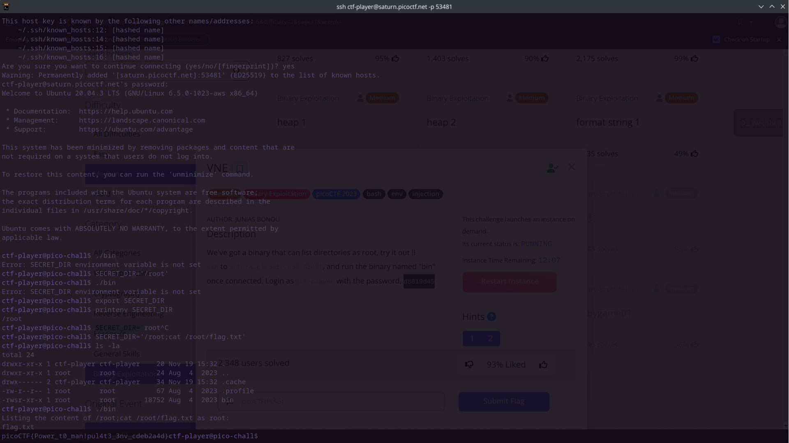

# VNE


## Background

After we successfully ssh into the server, we're put into a terminal with restricted commands and access. Some common commands such 
as chmod for modifying the permissions of a file and sudo for super user execution of files are inaccessible. Some of the commands
available to us are ls, dir, and cd which allow us to traverse directories and view files on the system. Within the home directory
there is a file a singular executable './bin' with the user permissions set to 'rws'. After some research I learned that the s 
permission allows whoever is executing the file to temporarily have the privileges of the user. This is going to be a good
vector of attack for privilege escalation.


## Solution

When we attempt to run the ./bin file we see that the file demands a SECRET_DIR environment variable to complete the program.
Our root directory is inaccessible to us so we will assume that to be our secret directory. We can set up the environment 
variable as such:

``` 
$SECRET_DIR='\root'
$export SECRET_DIR
```

The commands above will create a variable then export it to our environment variables. After running the ./bin file once more
we can see that the program lists the files in the directory, as told in the challenge description. All that's left for us is
to output the file. Trying to output the flag directly with commands such as cat or using a text editor doesn't work due to the
file's permissions so we must find a way of using our temporarily elevated access within the program to output the contents of
the file. Returning to our global variable, if the program simply runs ls on our SECRET_DIR path, then we can inject our own
commands in this environment variable and they will execute. Using bash command concatenation, we can split our commands with
the ';' character and attach any commands after that. Executing 'cat' on the path of the flag within the environment variable
prints the contents of the flag.  
