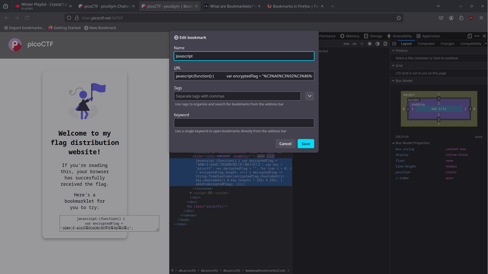
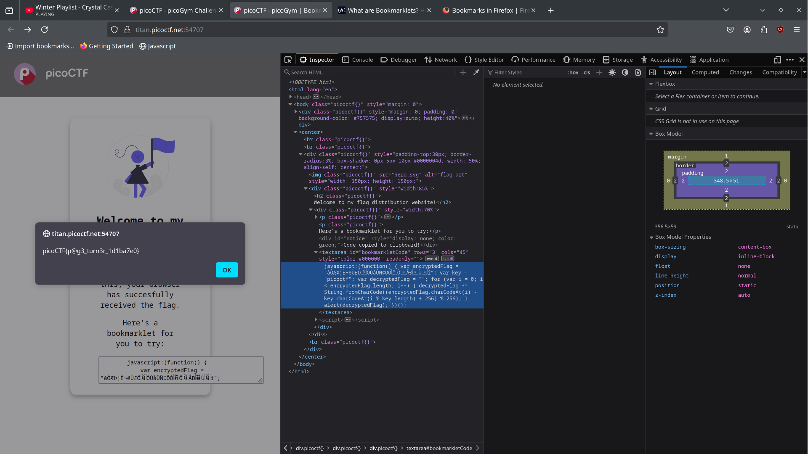

# Bookmarklet

## Background

Bookmarklets allow you to run javascript in your browser by creating a bookmark and putting the javascript directly into the url path.
This javascript function then executes when you call the bookmark. 

## Solution

Looking through the page source we see a function which decrypts the flag and makes an alert through the browser, to receive the flag we must find
a way of calling the function. Since the flag is loaded into the browser, we can use the bookmarklets feature to invoke the javascript function within 
the webpage. We can create a bookmarklet by copying the function which will decrypt and alert our flag, and pasting it into the url section of the bookmark. 
 

## Flag

Finally we can retrieve our flag after our browser gives us an alert popup. 

