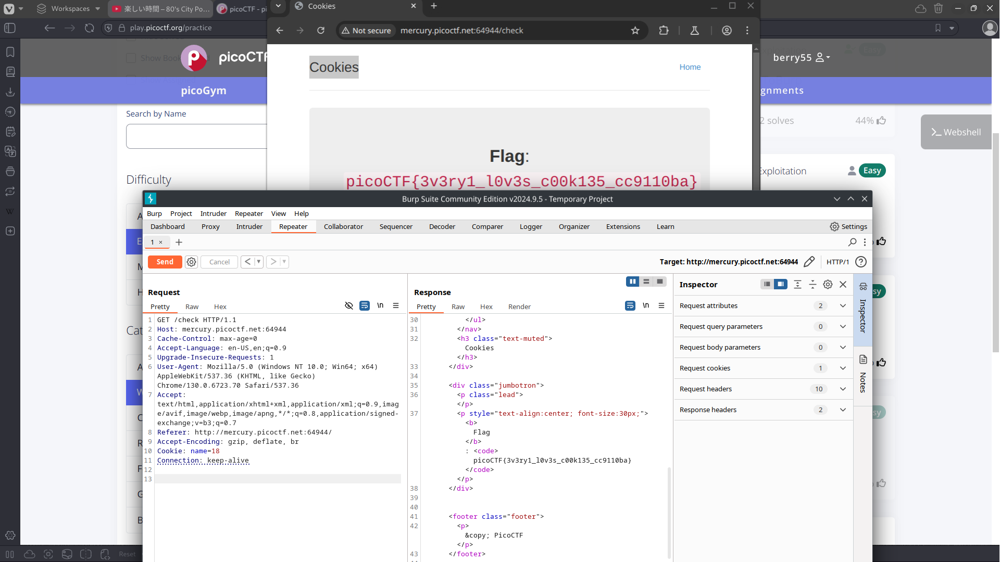

# Cookies

## Background

Cookies are used in web browsers to maintain information about a user or a connection. It is a method of storing information 
between the client and the server. When we access the webpage we have an input form with placeholder text 'snickerdoodle', in 
reference to the cookie. After submitting the request with snickerdoodle our cookie is set to a value of one.

## Solution

After trying a few other inputs, the 'name' cookie always responds a value -1 which is assumed to be invalid. As -1 is invalid and
0 is snickerdoodle, we can continue to increment the name cookie and see that the webpage returns different cookie names. After 
incrementing to 18, the webpage returns the flag. 
