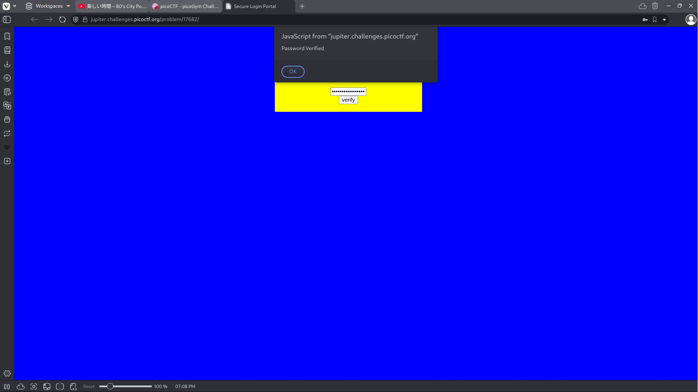

# Dont Use Client Side

## Background

Client side authorization isn't secure as the password is stored within the browser. The comparison is made using
the information given by the user in the input field, and the javascript function attempts to obfuscate the password. This
obfuscation can be bypassed or reverse engineered.

## Solution

The webpage source contains series of nested if statements. It takes the user input and verifies that it matches the conditions. By
simply ordering the if statements based on their index in the substring we can find the flag.

- (checkpass.substring(0, split) == 'pico') {

- (checkpass.substring(split, split*2) == 'CTF{') {

- (checkpass.substring(split*2, split*3) == 'no_c') {

- (checkpass.substring(split*3, split*4) == 'lien') {

- (checkpass.substring(split*4, split*5) == 'ts_p') {

- (checkpass.substring(split*5, split*6) == 'lz_b') {

- (checkpass.substring(split*6, split*7) == '706c') {

- (checkpass.substring(split*7, split*8) == '5}') {

We can deduce that the flag is picoCTF{no_clients_plz_b706c5}. The webpage alerts us that the password has been verified
signaling we have correctly retreived the flag. 
