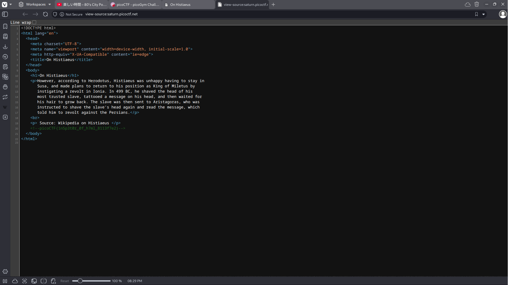

# Inspect HTML

## Background

Using developer tools on browsers is a good way to find more information about a webpage or modify the attributes within the 
console. This challenge is named inspect html so of course we open the developer tools and inspect the page source.

## Solution

After right clicking and opening the page source, we can view the flag commented out directly in the html file. 
