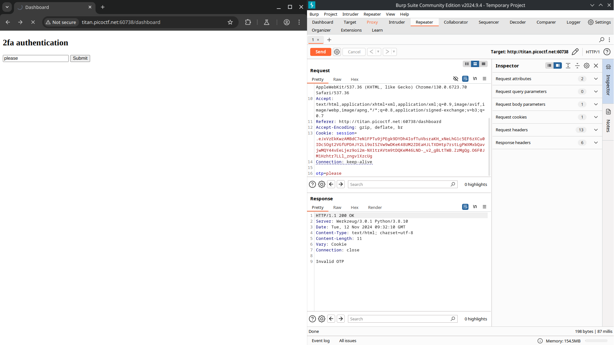
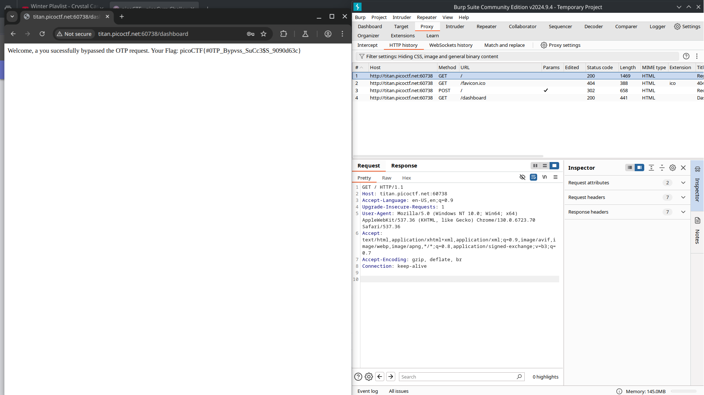

# Intro To Burp

## Background 

Intro to Burp references the burpsuite application which is used to exploit web vulnerabilities. It has useful tools such as proxying web pages and 
modifying requests. For this challenge I'll be proxying burpsuite through my browser in an attempt to bypass the authentication websites.

## Solution

The challenge begins by landing us on a registration page where we can enter information for a registration, once the registration is filled the page
redirects to a two-factor authentication with a one-time password. We do not have access to the one-time password and thus can't log access any further. 
This is where the burpsuite proxy comes in handy, we can see that there is an otp field in the request that returns "Invalid OTP". 

The solution to this challenge is simple. Once we remove the otp field and send the request without it, the webpage grants us access and returns the flag. 
