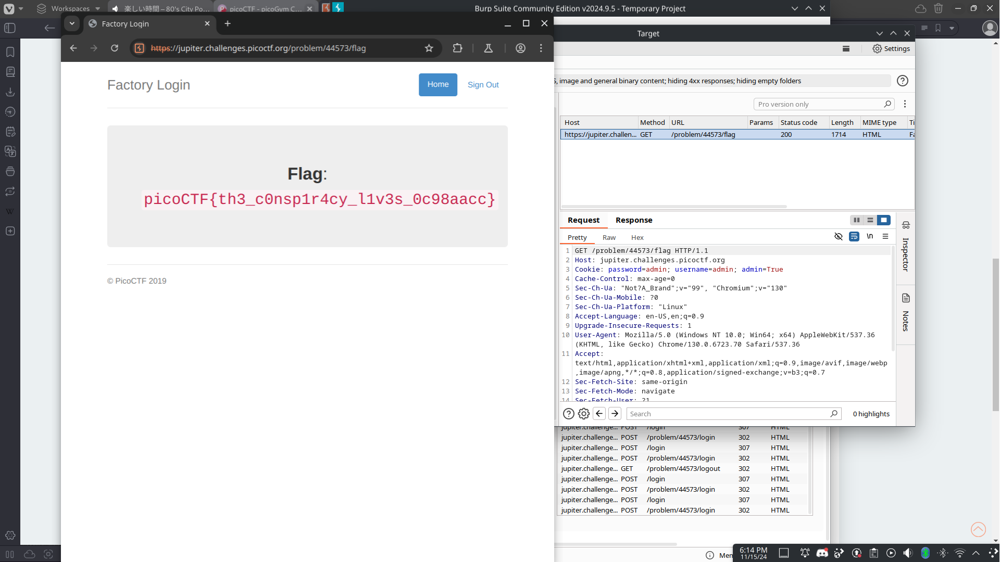

# Logon

## Background

This challenge sends us to a webpage with a login form and asks us if we can login as Joe. Attempting to log in as Joe is challenging,
however the website allows you to login as anyone else but Joe. From within the system we can attempt to escelate our privileges.

## Solution

When looking at the request form we can see that there's an admin section
that is set to False. Assuming that Joe also has this priviledge our goal is to also have the admin set to true. After having logged in as 
any user, we can send a request with the admin section set to True instead of False, and this will redirect us to a flag page that outputs 
the flag. 
