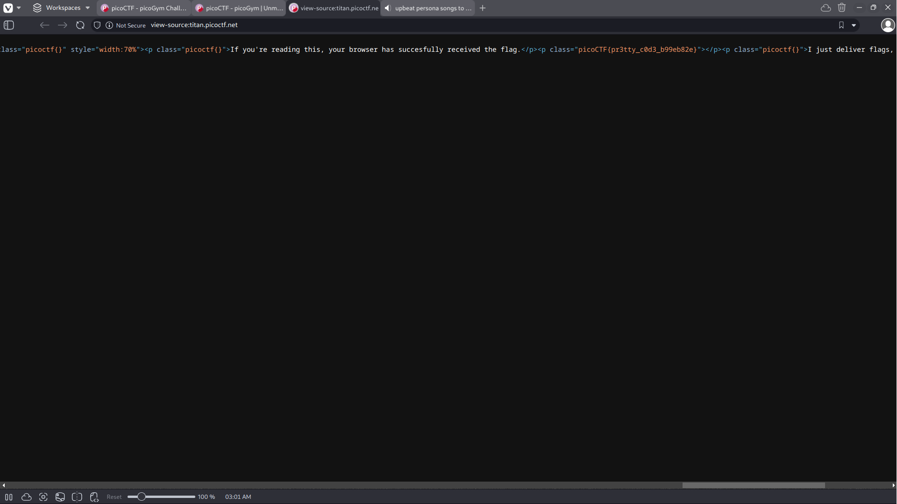

# Unminify

## Background

This webpage has all of its content displayed in a single line of code. The webpage also tells us that the flag has already
been loaded into our browser once we visit the webpage.

## Solution

Simply scrolling through the line of code we can view the flag in plaintext. flag: picoCTF{pr3tty_c0d3_b99eb82e} 
