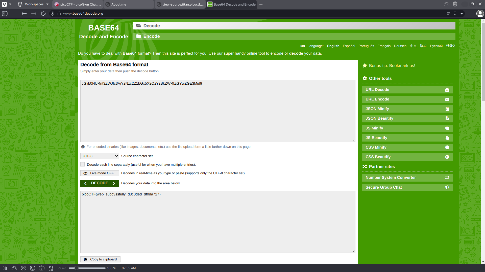

# Web Decode

## Background

The description of this challenge asks "Do you know how to use the web inspector?" This gives us the direction to 
begin our search for the flag. Going through the links in the source code we can inspect each page and look for 
something interesting.

## Solution

In the About page, there is a header centered on the page that informs us to try inspecting this page in hopes of 
finding the flag. After looking through the page's source code we find a section class with the value
notify_true="cGljb0NURnt3ZWJfc3VjYzNzc2Z1bGx5X2QzYzBkZWRfZGYwZGE3Mjd9". This value at first glance looks like 
base64 so a base64 decoder is a good attempt. After inputting the quoted value, our flag is decoded.

flag : picoCTF{web_succ3ssfully_d3c0ded_df0da727} 
