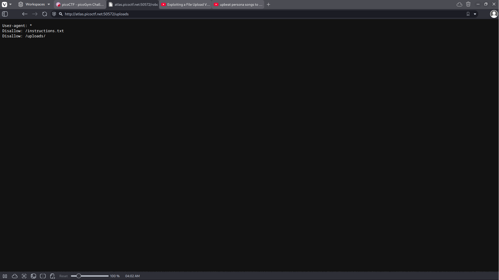
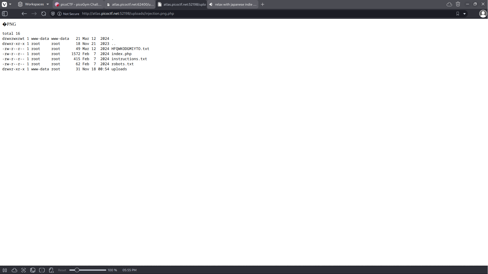
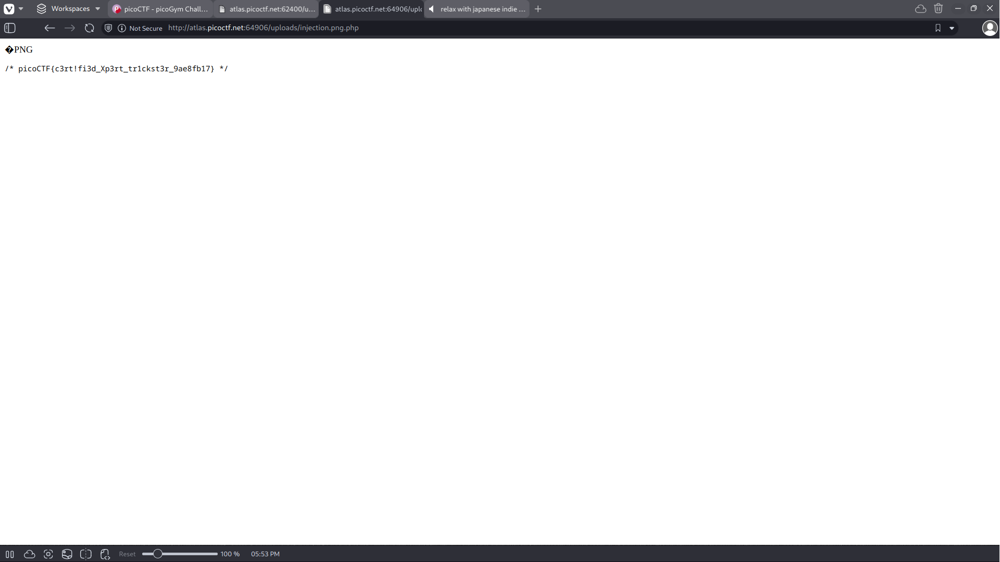

# Trickster


## Background

This challenge gives us a form to upload png images. The prompt tells us that the file will be processed as a PNG file.
This gives us insight into how this challenge can be solved, we must find a way to upload a file that will pass
the png processing and execute within the webserver to retrieve us the flag.


## Solution 

Firstly we check the image submission, uploading a regular png file we get that the file has successfully submitted, though
we don't know where the file has been submitted to. Going to the robots.txt file of the webpage, we get some useful links. 


The first link we can check is the instructions.txt file which tells us two things, firstly the method that the website processes
files that we upload. The processor simply checks for the first few magic bytes of the PNG file structure, meaning we can inject
another file into the upload prompt as long as we have those magic bytes at the start. Secondly we see that the folder where uploads
are stored are in the ./uploads/ subdirectory. Although we cannot directly view the uploads folder we can view the files we upload by 
completing its path. Writing a simple php injection which lists the contents of the uploads directory we can view the entire uploads folder:

```
<?php $output = shell_exec('ls -lart ../'); echo "<pre>$output</pre>"; ?>
```

The output is the contents of the /uploads/ folder: 


The text file named a string of characters is likely the file we would like to view to retrieve the flag. Although we can't directly access
the file by inputting the path, we can modify our php injection to cat the contents of the file. Subsequently visiting the page for our 
injection file, we retrieve the flag: 
